Los diagramas de Mermaid son una forma de representar gráficos y diagramas utilizando una sintaxis de texto simple y declarativa, que luego se puede transformar en una representación visual. Mermaid es una herramienta que facilita la creación de diagramas dinámicos y estáticos para la documentación de software y otras necesidades de visualización, todo dentro de archivos de marcado como Markdown, sin la necesidad de herramientas externas de gráficos o diagramas.

En cuanto a los diagramas de clases, que son una parte esencial de la modelación en la ingeniería de software, especialmente cuando se trabaja con el paradigma de la Programación Orientada a Objetos (POO), Mermaid ofrece una sintaxis para definir clases, junto con sus propiedades y métodos, así como las relaciones entre ellas, como la herencia, la asociación, la composición y la agregación.

Sin embargo, Mermaid no es tan extenso en la modelación de diagramas de clases como otras herramientas especializadas como UML (Unified Modeling Language) y sus herramientas dedicadas. Mermaid se centra más en la facilidad y accesibilidad, integrándose bien con entornos que soportan Markdown, lo que lo hace muy útil para la documentación en GitHub, GitLab, y otras plataformas similares.

## Patrones de diseño creacional
1. Singleton 
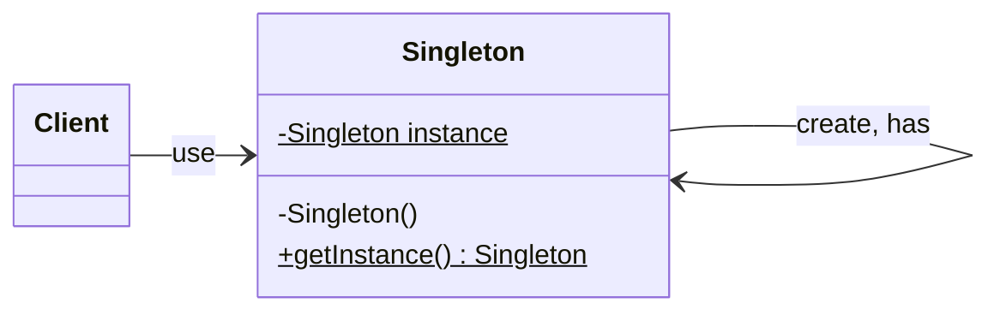
2. Factory Method
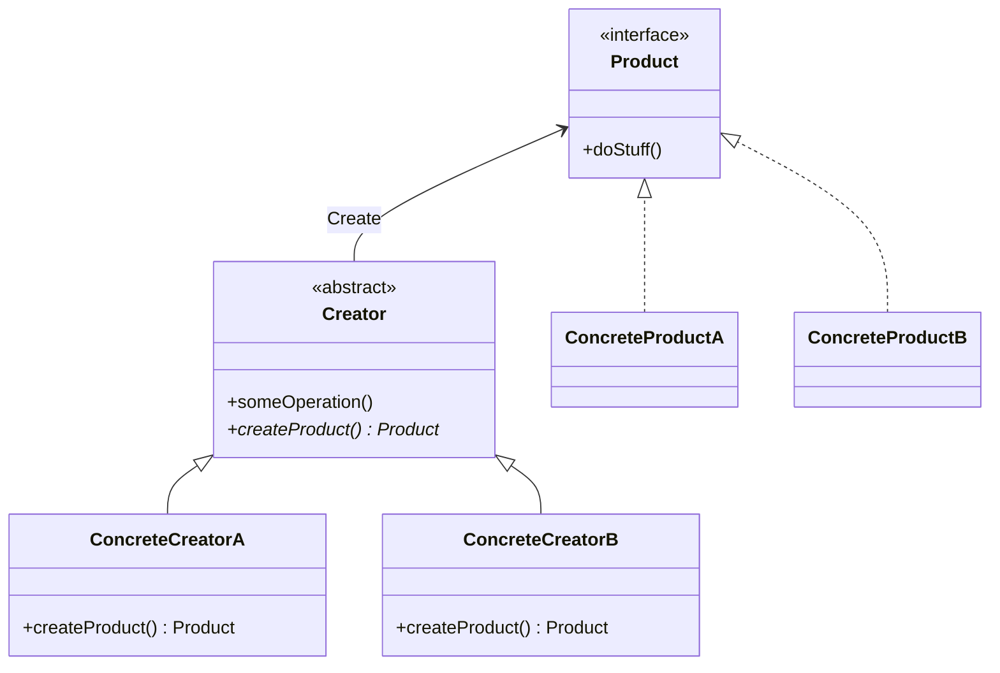
3. Abstract Factory
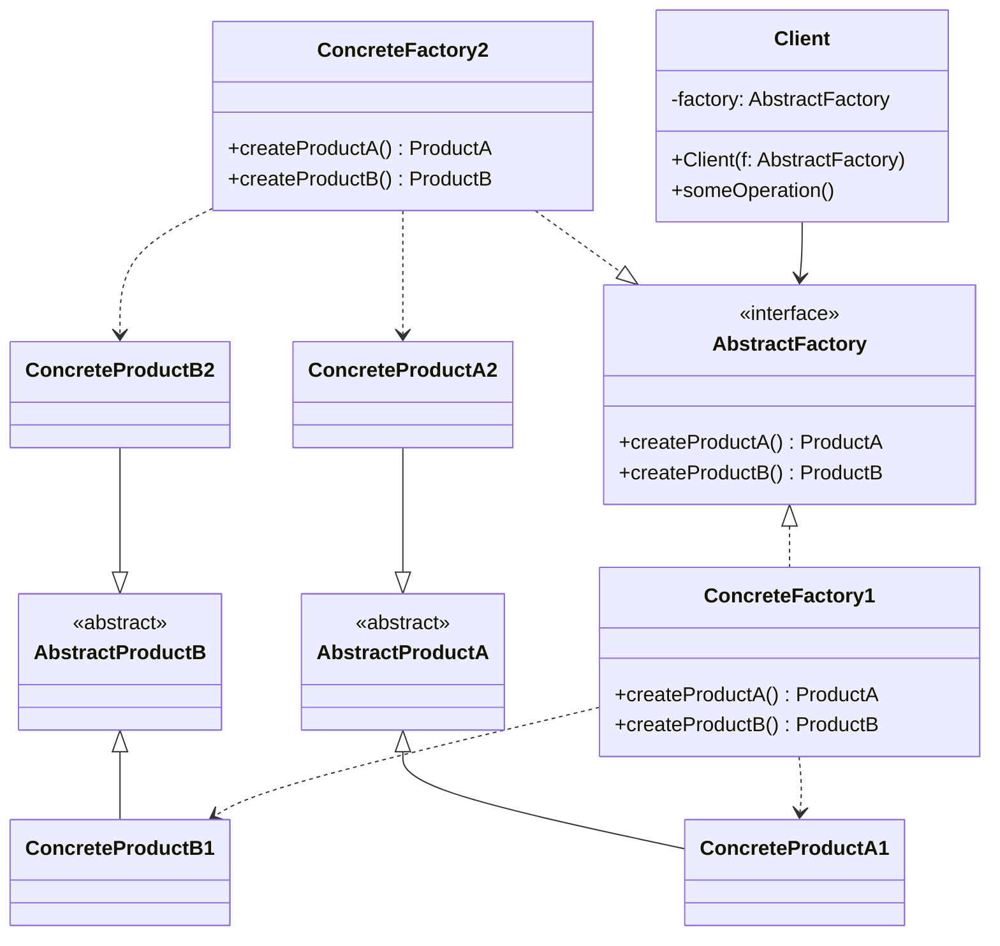
4. Builder
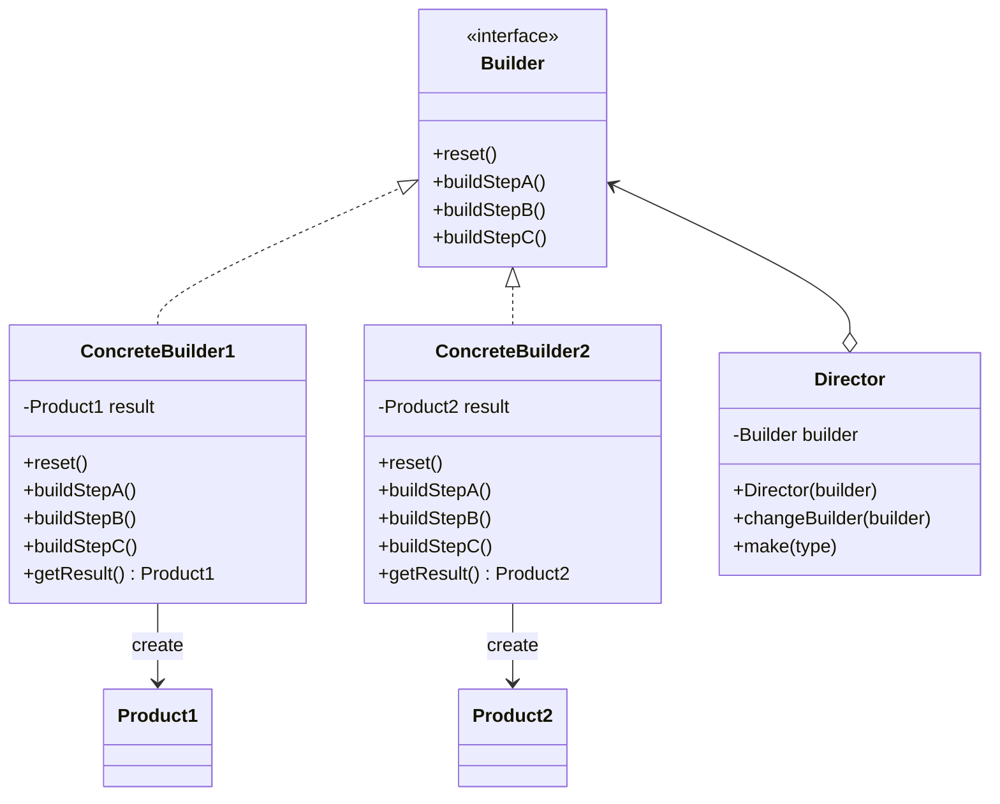
5. Prototype
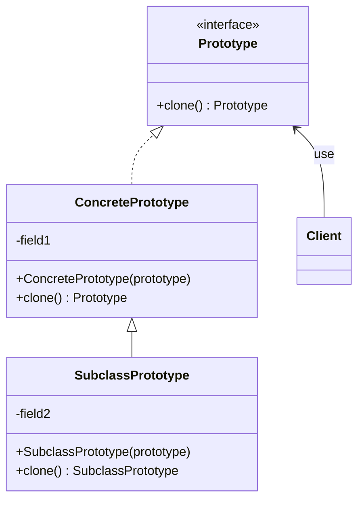
## Patrones de diseño estructural
6. Adapter 
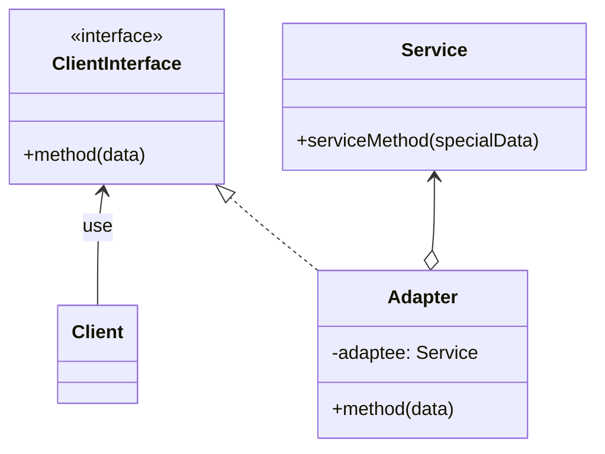
7. Decorator
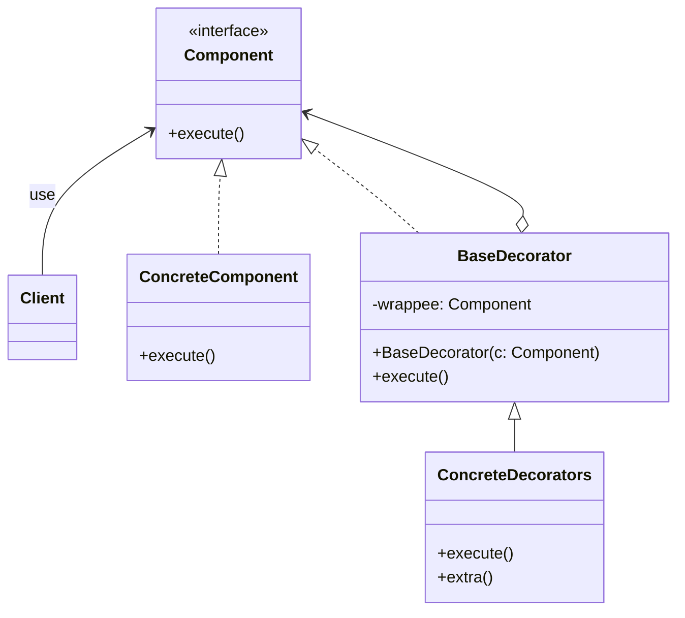
8. Facade
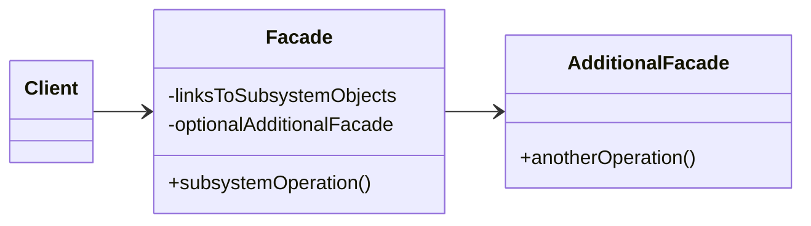
9. Proxy
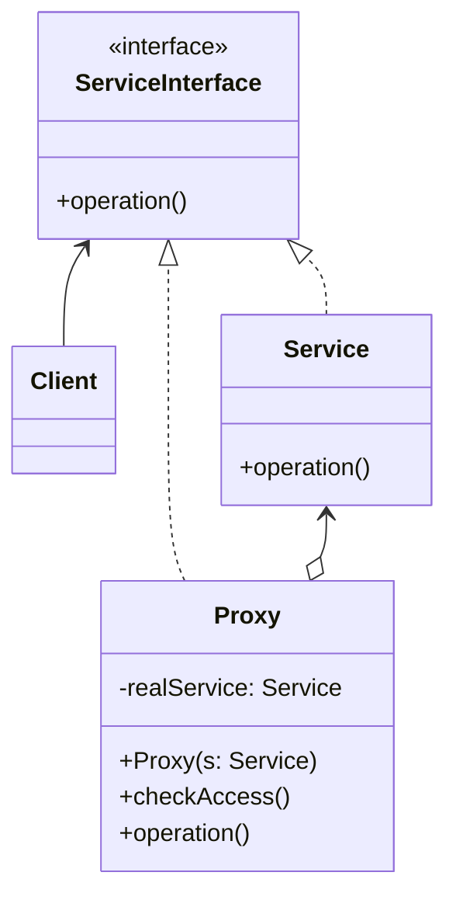
## Patrones de diseño de comportamiento
10. Chain of Responsibility
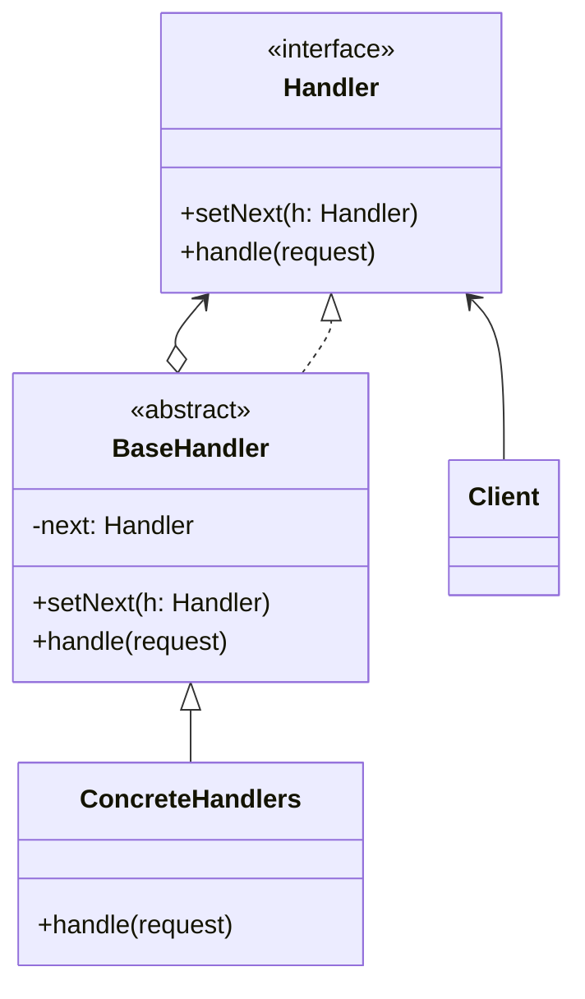
11. Iterator
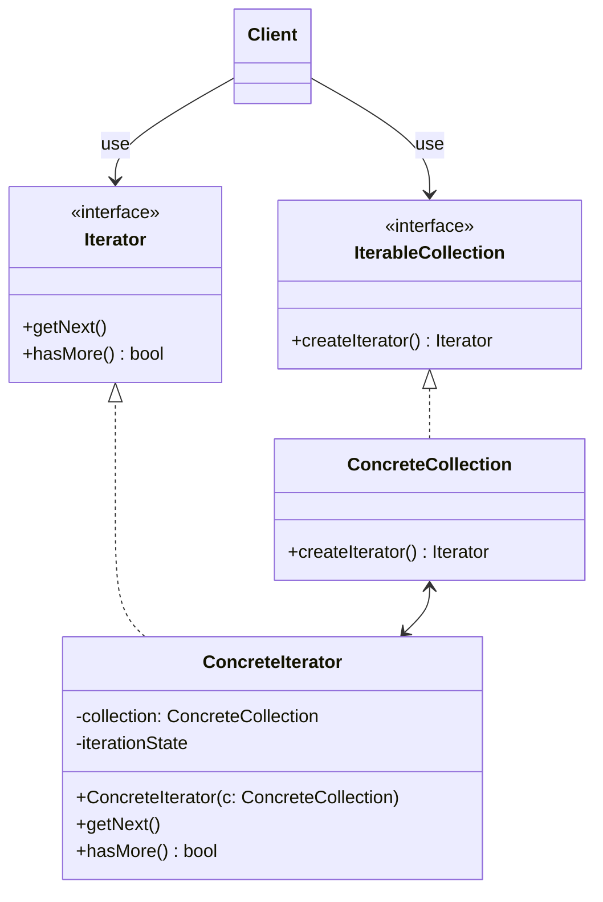
12. Observer
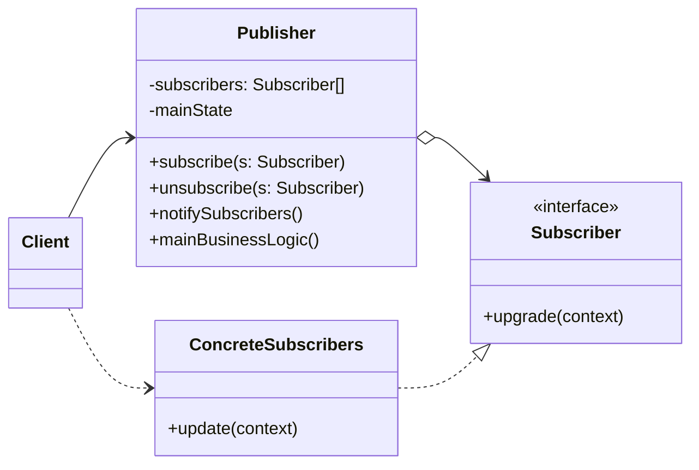
